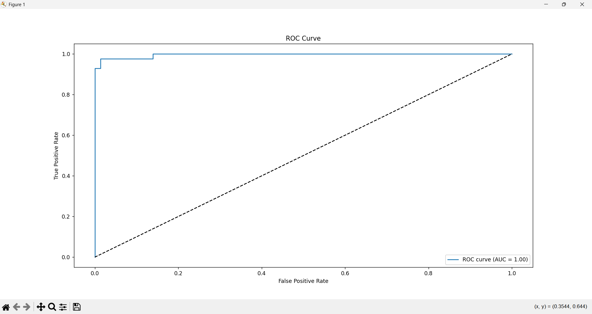

🩺 Breast Cancer Classification with Logistic Regression
This project uses the Breast Cancer Wisconsin (Diagnostic) Dataset to predict whether a tumor is Malignant (M) or Benign (B) using Logistic Regression.

📂 Dataset
Source: Kaggle – Breast Cancer Wisconsin (Diagnostic)

File: breast_cancer.csv

Target Column: diagnosis (M = 1, B = 0)

After Cleaning: Training set – (455, 30), Test set – (114, 30)

⚙️ Workflow
Load and clean the dataset by removing unnecessary columns.

Map diagnosis labels to numeric form.

Split data into train and test sets (80/20).

Standardize features to improve model performance.

Train the Logistic Regression model.

Evaluate the model performance.

Tune the classification threshold to analyze precision-recall trade‑offs.

📊 Model Performance
Metrics:

Precision: 0.97

Recall: 0.93

ROC‑AUC: 1.00

⚖️ Threshold Tuning Results
Threshold	Precision	Recall
0.3	0.98	0.98
0.5 (default)	0.97	0.93
0.7	1.00	0.90
Insights:

Lower thresholds increase recall (catch more malignant cases).

Higher thresholds increase precision (reduce false positives).

In medical cases, higher recall is preferred to avoid missed diagnoses.

🧮 Sigmoid Function
The sigmoid function converts the model output into a probability between 0 and 1, making it possible to classify a case as Malignant or Benign based on a chosen threshold.

📈 Visualizations
Confusion Matrix:

Roc Curve:

🧠 Key Takeaways

Logistic Regression is fast, interpretable, and effective for binary classification.

Scaling features greatly improves model performance.

Threshold tuning is essential when false negatives have high costs.

The sigmoid function is central to probability‑based predictions.

